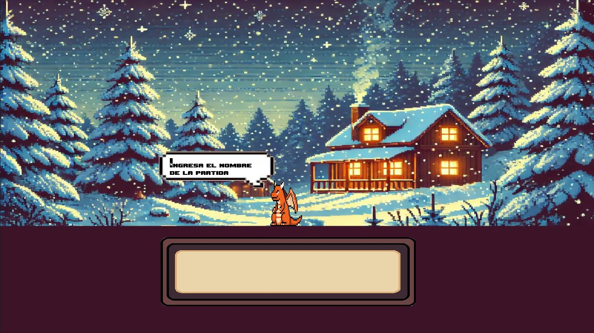

# LOGO LAND

## Descripción
**Logo Land** es un juego en el que los jugadores deben elegir el logo correcto de una marca o empresa a medida que avanzan en el juego. Incluye un sistema de guardado de partidas, un selector de skins, una opción para borrar partidas guardadas, y un sistema de monedas. Además, se muestra el récord de monedas acumuladas global y el promedio de tiempo de respuesta por logo al finalizar cada partida.

## Instalación
### Requisitos Previos
- Python
- Pygame

### Instrucciones de Instalación
Clona el repositorio:
   ```bash
   git clone https://github.com/Keruza3/Proyecto-python-juego
    
  ```
## Uso
### Cómo Jugar

Para iniciar el juego:

Tenes que runnear el codigo en main.py

### Controles

Mouse: Navegar por los menús y seleccionar opciones
### Funcionalidades

#### Sistema de guardado: Guarda hasta 4 partidas con el nombre del jugador.
#### Selector de skins: Personaliza la apariencia de tu personaje.
#### Borrado de partidas: Elimina partidas guardadas para liberar espacios.
#### Sistema de monedas: Acumula monedas a medida que juegas.
#### Récord de monedas: Muestra el mayor número de monedas acumuladas entre todos los usuarios.
#### Promedio de tiempo de respuesta: Indica el tiempo promedio que tardas en responder cada logo.

# Imagenes





